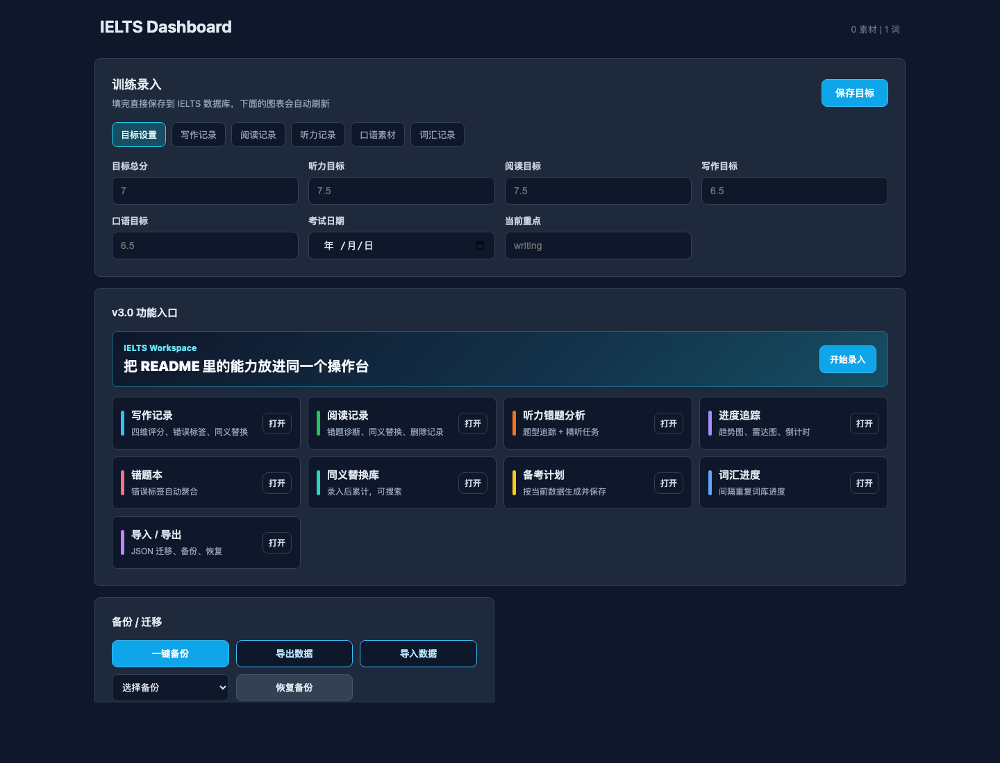

# IELTS Availed

一个用 Docker 部署的雅思备考 Dashboard。它把目标设置、训练记录、错题本、同义替换库、备考计划、导入导出和可视化图表放在同一个网页里，适合本地长期记录自己的 IELTS 备考数据。

## 效果演示



## 主要功能

- **训练录入**：在网页里记录写作、阅读、听力、口语素材和词汇。
- **记录管理**：写作、阅读、听力、口语记录支持查看和删除。
- **进度追踪**：展示考试倒计时、四科雷达图、写作趋势、阅读/听力正确率趋势。
- **错题本**：保存训练时填写的错误标签，并自动聚合高频错误。
- **同义替换库**：写作、阅读、听力记录里的同义替换会进入累计库，并支持搜索。
- **备考计划**：根据目标分和当前数据生成优先级与训练安排，可保存到本地数据目录。
- **导入 / 导出**：可以把当前 IELTS 数据导出成 JSON，也可以从 JSON 导入恢复。
- **备份 / 恢复**：一键备份当前数据，并可从备份列表恢复。
- **Docker 部署**：不需要手动启动 Vite，打开 `localhost:8080` 即可使用。

## 快速开始

### 1. 克隆项目

```bash
git clone https://github.com/your-username/ielts-availed.git
cd ielts-availed
```

### 2. 启动 Docker

```bash
docker compose up -d --build
```

启动后打开：

```text
http://localhost:8080
```

### 3. 停止服务

```bash
docker compose down
```

## 数据保存位置

网页里的训练数据不会写进项目仓库，而是保存到本机：

```text
~/.ielts
```

Docker 会把它挂载到容器里：

```text
/data/.ielts
```

备份文件保存在：

```text
~/.ielts-backups
```

## 导入导出

在网页的 **备份 / 迁移** 面板里可以：

- 点击 `导出数据` 下载当前数据 JSON。
- 点击 `导入数据` 选择之前导出的 JSON。
- 导入前系统会自动备份当前数据，避免覆盖后无法找回。

导出的 JSON 是这个网页自己的数据包格式，建议只导入从本项目导出的文件。

## 本地开发

如果不通过 Docker，也可以本地开发 Dashboard：

```bash
cd dashboard
npm install
npm run dev
```

构建生产版本：

```bash
npm run build
```

## 项目结构

```text
.
├── dashboard/                 # React Dashboard
│   ├── src/components/         # 录入、诊断、备份、图表组件
│   └── src/utils/              # 数据读取和聚合
├── docker/                     # Docker 服务入口和 API server
├── scripts/                    # Dashboard 数据导出脚本
├── Dockerfile
├── docker-compose.yml
└── README.md
```

## 技术栈

- React
- Vite
- Recharts
- Node.js HTTP server
- Docker Compose

## License

[MIT](./LICENSE)
